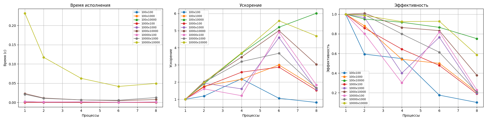

# Лабораторная 1 — MPI

Результаты и графики лежат в папке `lab1/task_1/`.

## Задание 1. Вычисление числа π

На каждом процессе независимо генерировались случайные точки внутри квадрата `[-1; 1] x [-1; 1]`.  
Процесс считал, сколько точек попало в единичную окружность.  

## Сводный график для задания 1

Выводы

При большом числе точек (N = 10 000 000) распараллеливание даёт существенный выигрыш:
время на 1 процессе ≈ 0.196 с, на 8 процессах ≈ 0.034 с (ускорение примерно в 6 раз).

Эффективность высока (порядка 0.9-1.0) для 2-4 процессов и снижается до ~0.7 при 8 процессах
из-за накладных расходов MPI, но даже при этом программа остаётся быстрее последовательной.

Для маленьких задач (N = 100 000) прирост по времени меньше - накладные расходы становятся заметнее.

Точность оценки π в первую очередь растёт с увеличением количества точек и почти не зависит
от числа процессов: параллелизация влияет на скорость, но не ухудшает качество результата.

Работа (код, замеры, построение графиков и анализ) выполнялась совместно нашей группой.

Код для задания 1: lab1/task_1/task1.c.

## Задание 2. Умножение матрицы на вектор
### Алгоритм умножение по строкам
Был реализован алгоритм для умножения матрицы на вектор используя разбиение по строкам

### Графики

Результаты показали, что эффективность алгоритма существенно зависит от размера и формы матрицы. Для малых задач накладные расходы MPI превышают выигрыш от распараллеливания. Для задач большой размерности (особенно квадратных) наблюдается хорошая масштабируемость и высокая эффективность вплоть до 6–8 процессов. Оптимальное число процессов для средних задач составляет 4–6.

## Задание 3. Матричного умножения с разбиением на блоки по алгоритму Кэннона
# Лабораторная — MPI, алгоритм Кэннона

## Задание

Реализовать умножение квадратных матриц с разбиением на блоки по алгоритму Кэннона и исследовать:

- как время работы зависит от размерности матриц и числа процессов;
- ускорение `S(p)` и эффективность `E(p)`.

## Реализация

Код: `cannon.c` (MPI-программа на C).

Основные шаги:

- запрашиваем размер матрицы `n` и число процессов `p`;
- проверяем, что `p` — полный квадрат и строим 2D-решётку процессов `grid_size x grid_size` с помощью `MPI_Cart_create`;
- каждую матрицу `A` и `B` делим на блоки `block_size x block_size`, каждый процесс хранит по одному блоку;
- начальное выравнивание по Кэннону:
  - блоки `A` циклически сдвигаются влево на `row` позиций,
  - блоки `B` — вверх на `col` позиций;
- выполняем `grid_size` шагов:
  - локальное блочное умножение `C += A * B`;
  - циклический сдвиг блоков `A` влево, `B` вверх (через `MPI_Cart_shift` и `MPI_Sendrecv_replace`);
- замер времени: вокруг вызова `cannon_multiply` ставим `MPI_Barrier` и `MPI_Wtime`, на процессе 0 берём максимум по всем процессам (`MPI_Reduce` с `MPI_MAX`).

Последовательное время `T1` и параллельное время `Tp` использовались для расчёта:

- ускорение: `S(p) = T1 / Tp`;
- эффективность: `E(p) = S(p) / p`. :contentReference[oaicite:0]{index=0}

## Эксперименты

Размеры матриц:

- `120×120`
- `300×300`
- `600×600`
- `900×900`

Число процессов (потоков на графиках): `p = 1, 4, 9, 16`.

По измеренным временам построены три графика:

### Время работы

### Ускорение

### Эффективность

## Выводы

- Для больших матриц (`600×600` и `900×900`) время работы сильно уменьшается при увеличении числа процессов:  
  для `900×900` время падает примерно с ≈8–9 секунд на 1 процессе до <1 секунды на 16 процессах.
- Ускорение для крупных матриц близко к линейному: при `p = 16` оно достигает ~15, что почти равно количеству процессов.
- Эффективность для больших матриц высокая:  
  для `900×900` она держится на уровне ~0.9 при 4 процессах и поднимается до ≈0.95–0.97 при 9–16 процессах, то есть ресурсы используются почти полностью.
- Для маленьких матриц (`120×120`) выигрыш от распараллеливания небольшой: время почти не уменьшается, а эффективность падает (до ~0.3 при 16 процессах) из-за заметных накладных расходов MPI.
- В целом алгоритм Кэннона хорошо масштабируется на квадратное число процессов при достаточно больших размерах матриц; для маленьких задач последовательная версия оказывается более рациональной.

Работа (реализация, замеры и построение графиков) выполнялась в команде.
