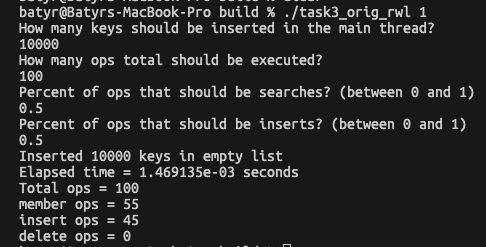
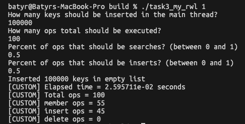
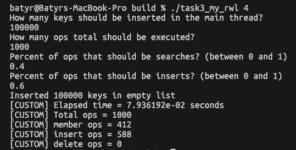
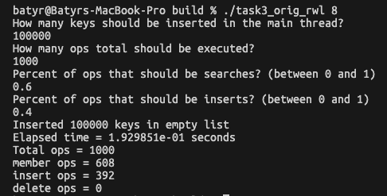
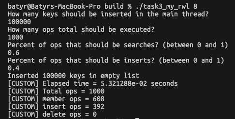

# Лабораторная работа №2

### Компиляция лабы
```bash
make
cd ./build
```
Появится папка `./build` с исполняемыми файлами. 
## Задача №1
Написать параллельную программу с использованием OpenMP для нахождения множества Мандельброта

### Реализация
Файлы:
`./task_1/mandelbrot.c`

### Запуск
Использование: `task1_madelbrot [nthreads] [npoints]`

```bash
./task1_mandelbrot 4 1000
```
Вывод в терминал:
```text
Result in ./output.csv file
Time elapsed: 0.369618s | 4 threads | 1000 points
```
На выходе будет создан <u>output.csv</u> файл с указанием координат точек


### Производительность


## Задача №2
### Закон всемирного тяготения (OpenMP)
Дано N материальных точек с массами mk, положения которых в начальный момент времени заданы радиус-векторами rk, а скорости векторами vk, k = 1, N. Требуется определить траектории всех частиц для времени от 0 до t_end.

### Реализация
Файлы:
`./task_2/nbody_omp.c`

### Запуск
Использование: `task1_nbody_omp [t_end] [input_file] OPTIONAL [nthreads]`

Нужно создать <u>input.txt</u> с данными для запуска. Пример:
```text
3
1.0 0.0 0.0 0.0 0.5 0.0
2.0 1.0 0.0 0.0 -0.3 0.2
1.5 -1.0 0.5 0.1 0.0 -0.1
```
Запуск в терминале:
```bash
./task1_nbody_omp 50.1 ./input.txt 8 
```
Вывод в терминал:
```text
Elapsed time: 0.342605s | Bodies: 3 | Threads: 8
```
На выходе будет создан <u>output.csv</u> файл с указанием *t* и *x<sub>1</sub>* *y<sub>1</sub>* ... *x<sub>n</sub>* *y<sub>n</sub>* 


## Задача №3
Создать свою реализацию типа rwlock и функций rdlock,
wrlock блокировки чтения-записи. Апробировать эту реализацию
на примере односвязного списка. См. файл pth_ll_rwl.c. Сравнить производительность своей реализации с библиотечной.

### Реализация
Файлы:
`./include/rwl.h`
`./task_3/rwl.c`

### Запуск
Использование: `task3_my_rwl [nthreads]`

```bash
./task3_my_rwl 8 
```

### Сравнение
|  **pthreads_rwl**          |  **custom rwl** |
:-------------------------:|:-------------------------:
1 thread | 1 thread
 | 
4 threads | 4 threads
 | 
8 threads | 8 threads
 | 


